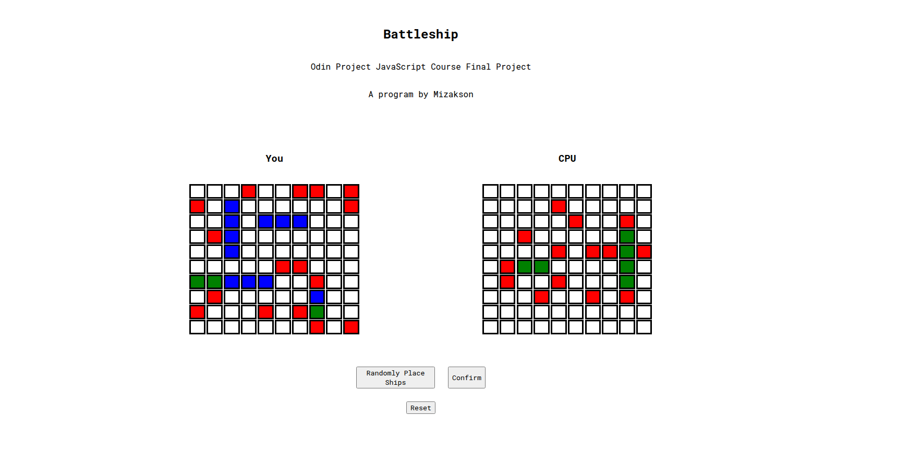

# battleship

## Odin Project JavaScript Course Final Project

## Table of Contents
* [Project Overview](#project-overview)
* [Live Demo](#live-demo)
* [Features](#features)
* [Tech Stack](#tech-stack)
* [Setup and Installation](#setup-and-installation)
* [Testing](#testing)
* [What I Learned](#what-i-learned)
* [Future Enhancements](#future-enhancements)
* [License](#license)

## Project Overview
This the final project of The Odin Project's JavaScript course. It's a classic game of Battleship built from the ground up using entirely vanilla JavaScript. This project helped me gain a solid understanding of core JavaScript concepts, including ES6 modules, factory functions, and unit testing.

For a complete breakdown of the rules, please refer to the official [rules of battleship](https://officialgamerules.org/game-rules/battleship/)

## [Live Demo](https://mizakson-battleship.netlify.app/)


Key:

  * __Blue Square__: Represents a ship in your own fleet.
  
  * __Green Square__: Indicates a successful hit on a ship.
  
  * __Red Square__: Marks a missed shot.

## Features
* __Play against the CPU__: Play against the computer in a game of Battleship.

* __Preset Ship Configurations__: Choose from a selection of pre-configured ship placements to get into the game quickly.

* __Game Reset__: Start a new game at any time with a single click.

## Tech Stack
* __Vanilla JavaScript__: The core game logic and user interface are built entirely with vanilla JavaScript.

* __Jest__: JavaScript testing library used to ensure the reliability all game functions through unit and integration tests.

* __Webpack & Babel__: Used for module bundling and transpiling of code.

* __style-loader__: A Webpack loader that helps properly load and inject CSS files into the DOM after the application is built.


## Setup and Installation

To get a copy of this project up and running on your local machine, follow these steps:

1. __Clone the repository__:
``` bash
 git clone https://github.com/Mizakson/battleship.git
 cd battleship
```
2. __Install Dependencies__:
``` bash
 npm install
```
3. __Run the application locally__:
``` bash
 npm start
```
## Testing
To run the test suite and verify the code's functionality, run the following command:
``` bash
 npm test
```
## What I Learned
* __Testing with Jest__: Gained extensive experience in writing unit and integration tests to ensure source code reliability.

* __Object-Oriented JavaScript__: Learned how to effectively use factory functions and ES6 modules to create a modular and scalable application structure.

* __MVC Design Pattern__: Understood how to apply the Model-View-Controller pattern to separate concerns and create a more organized and maintainable application.

* __Helper Functions and Factories__: Reinforced the importance of using helper functions and factory functions for creating reusable and modular components.

## Future Enhancements
* __Improved Ship Configuration__: Refine the logic for ship placement, potentially allowing users to manually place their ships.

* __Smarter CPU AI__: Enhance the CPU's ship-targeting logic to create a more challenging and dynamic opponent.

* __Session Persistence__: Add functionality to save game state, allowing users to continue a game where they left off.

## License
This project is licensed under the MIT License. See the `LICENSE` file for details.
